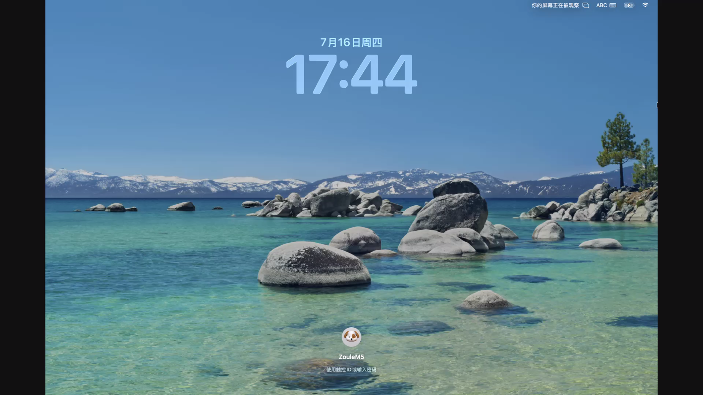
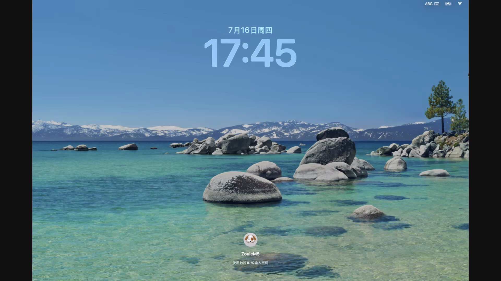
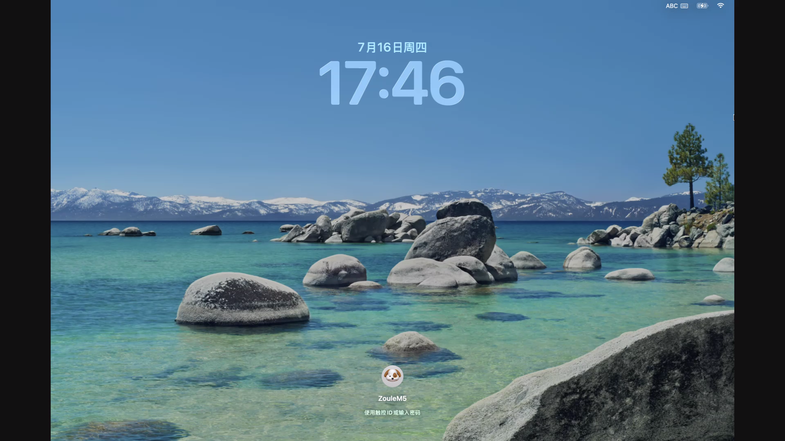
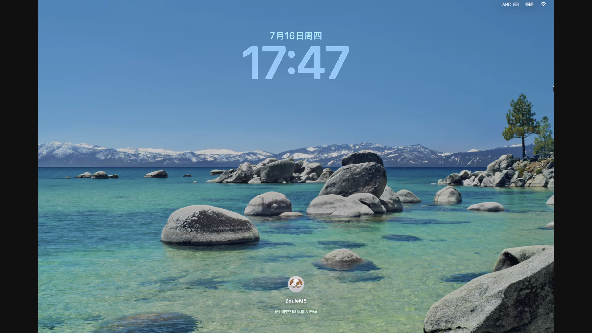

# macOS 主屏幕静态 Max-QP 对比

本报告记录同一台 Mac 发送到 Android TV API 31 arm64 emulator、经 production TURN/UDP 的四档静态画质实验。所有 case 均保持 1920×1080、静态 1 fps、动态 15 fps、5 Mbps；只改变静态 `MaxAllowedFrameQP`。

- 生成时间：`2026-07-16T09:48:11Z`
- XCFramework SHA-256：`9b551376bfbd056b70d8b75142efa697a049fcff9a27f6a2a4694a847b140ba4`
- macOS app commit：`25236cabf2a4a51357c7fdebfd144f45b3e0e022`
- 发送端：`Mac17,8` / macOS `26.5.2`
- 接收端：`WebRTCScreencast_TV_API_31` / API `31` / `arm64-v8a`
- 单档运行时长：`30 s`
- 路径：`relay/relay + UDP`（每档均由现有 E2E verifier 校验）
- 原始证据目录：`artifacts/static-max-qp/20260716T094423Z`

## 数据

| 请求 Max QP | 回读 Max QP | 实际 IDR QP | IDR bytes | generation | applied/sample encoder session | ICE path | Android 实收图 | `view_image` 观察 | VMAF（参考） |
|---:|---:|---:|---:|---:|---|---|---|---|---:|
| 24 | 24 | 24 | 137640 | 2 | `vt-0xafd08a800-2` | relay/relay + UDP | [PNG](2026-07-16-static-max-qp/qp-24-android-received-final.png) | 整帧完整，无色块/宏块；细密岩石与水面纹理相对稍软 | 50.465 |
| 22 | 22 | 22 | 166080 | 2 | `vt-0x85708a800-2` | relay/relay + UDP | [PNG](2026-07-16-static-max-qp/qp-22-android-received-final.png) | 整帧完整，无色块/宏块；时钟文字与背景细节清晰 | 50.939 |
| 20 | 20 | 20 | 214803 | 2 | `vt-0xa9f08a800-2` | relay/relay + UDP | [PNG](2026-07-16-static-max-qp/qp-20-android-received-final.png) | 整帧完整，无色块/宏块；细密纹理保留良好 | 50.258 |
| 18 | 18 | 18 | 247995 | 2 | `vt-0x9f308a800-2` | relay/relay + UDP | [PNG](2026-07-16-static-max-qp/qp-18-android-received-final.png) | 整帧完整，无色块/宏块；细密纹理保留良好 | 51.928 |

VMAF 仅作为参考列：reference 是接收截图前后同一静态主屏幕的本机截图，按 ScreenCaptureKit 相同的 aspect-fit/letterbox 几何缩放到 1920×1080。本轮画面是锁屏时钟与壁纸，不同 case 存在分钟数字、截取时刻和少量画面位置差异；因此它不是逐帧时间戳对齐的严格视频 VMAF，不能用 50.258 与 50.939 这类小幅差值给 QP 做严格排名，也不作为通过门槛。

ScreenCaptureKit 的 `showsCursor` 本轮仍始终开启；锁屏场景下 cursor 未必出现在最终截图中。

## 证据绑定

每个 case 在保存 Android 截图时同时固化一份 `static-qp-evidence.json`。自动化只在以下条件全部成立时接受截图：

- clarity mode 已进入 `static_clarity`；
- requested/effective Max QP 一致，VideoToolbox 回读为 `applied`；
- QP sample generation 等于 Max-QP generation；
- QP sample encoder session 等于实际应用 Max-QP 的 encoder session；
- 本机 reference 和 Android 截图前后 250 ms 内，generation/session 仍与同一份 evidence 一致。

四档 evidence 均标记 `generation-session-stable-across-screenshot`，截图与 evidence 落盘时间在同一秒内。报告生成器会拒绝没有该绑定标记的数据，不会再从 case 结束时的历史 metrics 推断截图对应 QP。

## Signaling 建链耗时

| 请求 Max QP | WebSocket connect (ms) | sender join → paired (ms) | offer → PeerConnection connected (ms) |
|---:|---:|---:|---:|
| 24 | 12.159 | 2.609 | 204.850 |
| 22 | 3.884 | 2.045 | 206.109 |
| 20 | 3.180 | 2.212 | 238.155 |
| 18 | 3.316 | 2.366 | 212.661 |

这些耗时来自 sender 的 monotonic event timestamps；只用于记录本轮 signaling/negotiation 建链，不代表 glass-to-glass latency。

## Android 实收画面

以下四张 1920×1080 PNG 均已使用 `view_image`、原始分辨率逐张检查。画面均为 Android TV 实际 decode/render 后的最终帧；左右黑边是主屏幕 aspect-fit 到 16:9 后的正常 pillarbox，未发现接收端 UI 覆盖、视频破损、色块或明显宏块。

### Max QP 24

### Max QP 22

### Max QP 20

### Max QP 18

## 结论与建议

本轮证明改造的核心闭环成立：运行时传入 24/22/20/18 后，VideoToolbox 会换用新 encoder session，并在与 Android 截图绑定的 IDR 上精确观测到 24/22/20/18。

在本轮锁屏静态场景中，IDR 大小随 QP 收紧而单调增长：`137640 → 166080 → 214803 → 247995 bytes`。结合逐图观察，建议：

- 静态默认使用 **Max QP 22**：相比 24 有更明确的画质余量，同时 IDR 体积增幅仍明显低于 20/18。
- 对画质更偏执且能承受更大 IDR 的参考实现，可选 **Max QP 20**。
- **Max QP 18** 已验证能精确生效，但本轮没有显示出足以支撑它成为默认值的可视收益，而 IDR 成本最高。
- 画面恢复动态后继续放宽到 **Max QP 32**，不用静态策略牺牲动态时的码率容量。

这个结论是一期参考实现的参数建议，不是通用画质门槛。
