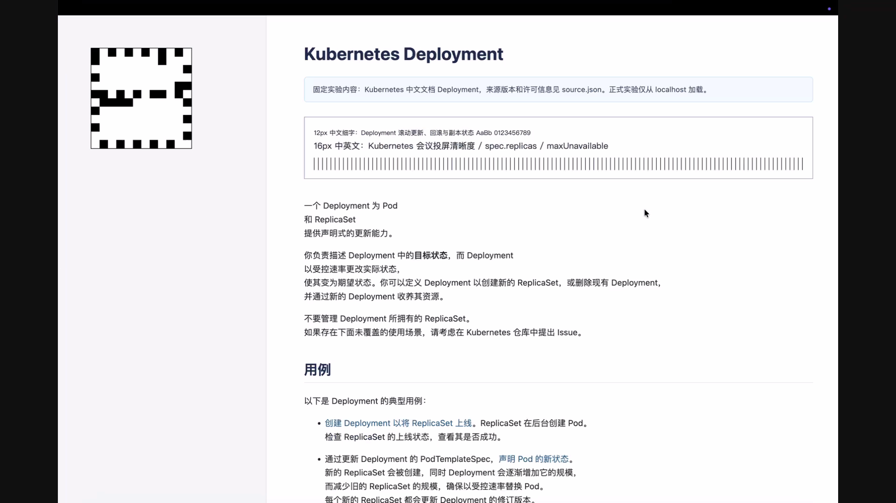
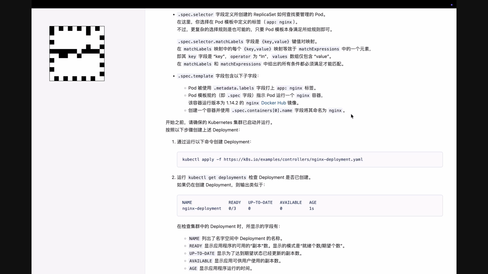
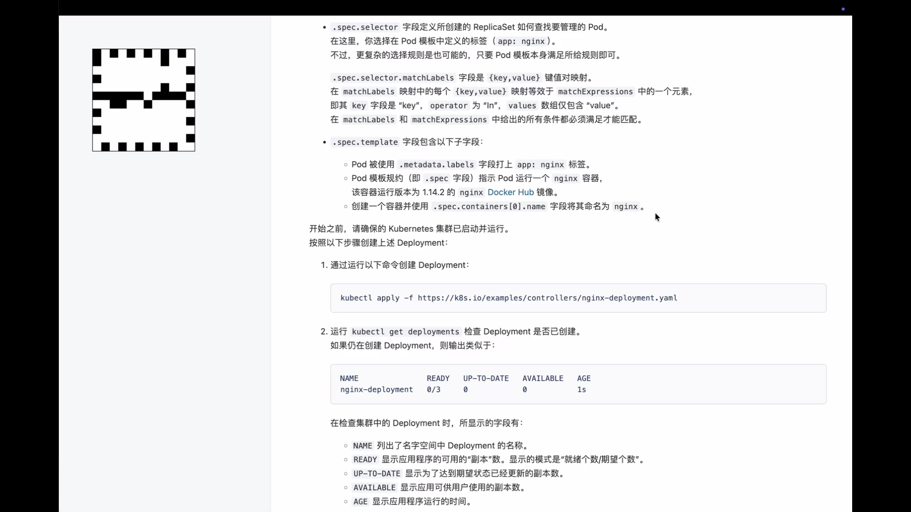
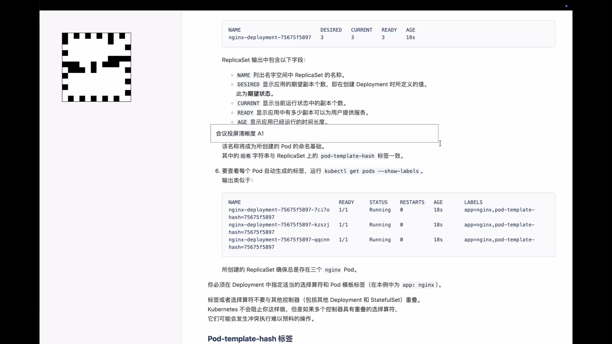
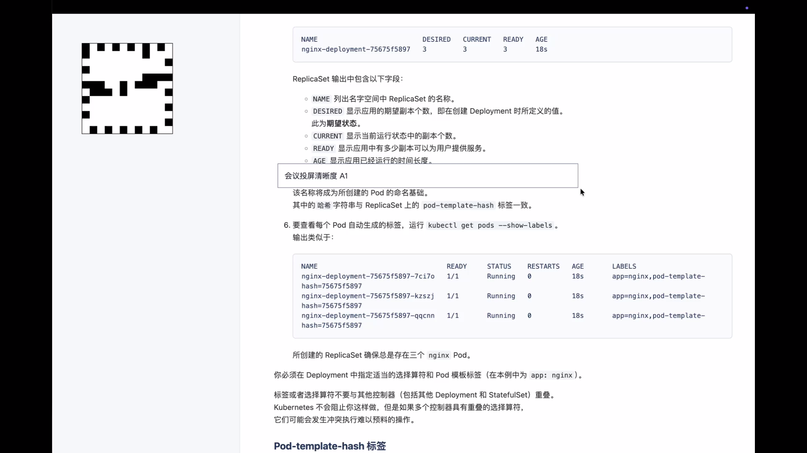
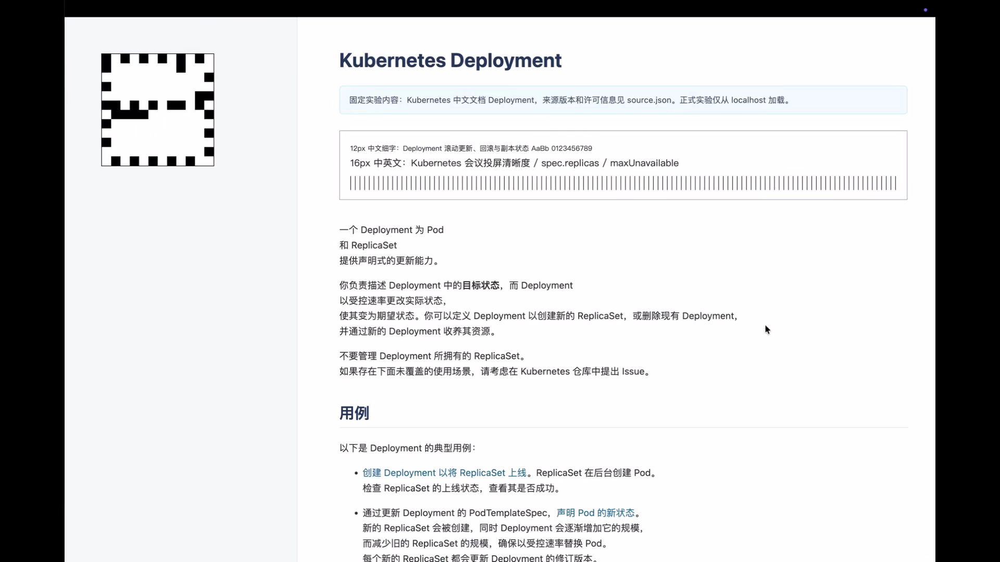
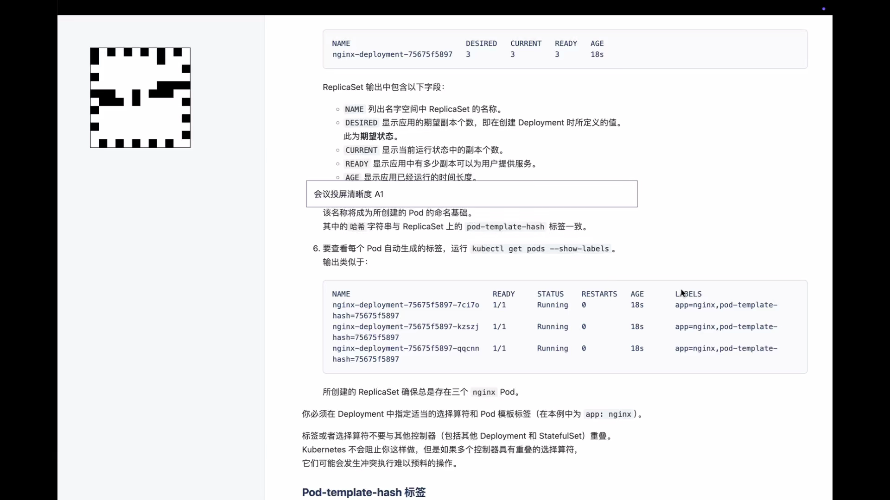

# DamageIdleDetector 实验结果（2026-07-18）

## 结论与上线决策

`DamageIdleDetector` 可以替换旧的 luma detector。它修复了核心故障：屏幕停住且没有新 capture callback 时，仍会在最后一次 damage 后约 600 ms 进入 STATIC；STATIC 下任意内容或 cursor damage 都会先恢复 15 fps 与 active MaxQP，再提交真实帧。macOS 顶部近全宽 dirty rect 只作为 capture status strip 候选，仅当前后两张完整 NV12 buffer 的 Y/UV active bytes 均一致时忽略；任一真实像素变化或比较失败都立即按 ACTIVE。同帧只要还有其它 damage 也仍然恢复 ACTIVE。该比较只在稀疏候选帧发生，实现保持两态，没有专用线程、10 fps 过渡态或逐帧 luma detector。

固定 H.264 head-to-head 完成 D0/D1 各三轮。D1 的 18 个业务动作全部触发 ACTIVE，18/18 marker 到达 Android，STATIC/ACTIVE QP 24/32 绑定正确，VT drop 为 0，静态画质未退化，峰值码率低于 D0。三轮 D1 只有第二次 fast-scroll 的接收侧出现一次重复性延迟尖峰；负责人确认单一 sequence 尖峰不阻断 detector 上线。render-gap 的 500 ms 绝对门槛也不再作为阻断项，因为测量窗口从 marker 更新开始，而 scroll workload 刻意等待 500 ms 后才真正滚动；该指标包含了实验主动制造的静止段。两项原始失败事实均保留，不改写数据。

经明确批准 gate waiver 后，执行了一次正式 H.265 33/39 smoke。review 修复 status-strip 像素核验后，又只增加一轮同参数 final-code regression smoke，没有扩展参数矩阵。两轮 H.265 都是 6/6 marker、六次 ACTIVE 恢复、QP 绑定正确、VT drop 为 0，人工原图检查通过。因此本轮决策是合入新 detector；不扩展 codec、QP 或 VideoToolbox feature matrix。

最终代码复核时曾在锁屏状态启动两次 H.265 visual smoke；页面内部 geometry readiness 虽然通过，原图却显示 macOS 锁屏，因此两次均判为无效基础设施数据，不计入 detector 结果，并已从 workspace 移入废纸篓。runner 已增加 console-lock preflight。console 解锁后的 final-code smoke 有效完成并通过全部 detector、codec、QP、media-path 和截图检查。

## 固定实验

- 正式结果目录：`artifacts/damage-idle/experiments/20260718T075636Z/`（Git ignored）
- final-code H.265 regression：`artifacts/damage-idle/experiments/20260718-final-code-h265/`（Git ignored）
- Chrome：`150.0.7871.129`
- Android：API 31、1920×1080 emulator
- 网络：production-relay UDP
- 内容：localhost 渲染的 Kubernetes 中文 Deployment 文档
- 动作：初始静止 20 秒；每隔 8 秒执行三次固定快速滚动、一次慢速滚动、一次固定文字输入、一次固定鼠标路径；最终静止 20 秒
- H.264：D0/D1 均使用 STATIC/ACTIVE MaxQP 24/32，顺序为 `D0,D1 / D1,D0 / D0,D1`
- H.265：一轮正式 H1，加一轮 review 修复后的同参数 regression；STATIC/ACTIVE MaxQP 均为 33/39

## H.264 head-to-head

| Case/run | 首帧 ms | ACTIVE E2E p95 ms | max render gap ms | 峰值 bitrate Mbps | VT drop | Marker | STATIC SSIM-Y / PSNR-Y | 人工原图 |
|---|---:|---:|---:|---:|---:|---:|---:|---|
| D0 run-1 | 1385.4 | 195.2 | 1000.0 | 4.80 | 0 | 6/6 | 0.6197 / 12.69 | 通过 |
| D0 run-2 | 1419.9 | 244.3 | 1000.0 | 4.50 | 0 | 6/6 | 0.6196 / 12.69 | 通过 |
| D0 run-3 | 1034.2 | 229.7 | 1000.0 | 3.28 | 0 | 6/6 | 0.6197 / 12.69 | 通过 |
| D1 run-1 | 1496.3 | 390.4 | 741.9 | 3.70 | 0 | 6/6 | 0.6205 / 12.80 | 通过 |
| D1 run-2 | 1410.9 | 346.0 | 741.8 | 4.31 | 0 | 6/6 | 0.6205 / 12.80 | 通过 |
| D1 run-3 | 1430.6 | 337.5 | 732.9 | 3.95 | 0 | 6/6 | 0.6209 / 12.79 | 通过 |

三轮 aggregate：

| 指标 | D0 | D1 | 结论 |
|---|---:|---:|---|
| 首帧中位数 | 1385.4 ms | 1430.6 ms | +45.1 ms，在 +100 ms 门槛内 |
| ACTIVE E2E p95 中位数 | 229.7 ms | 346.0 ms | 单一 sequence 接收侧尖峰，记录但不阻断 |
| 最大 render gap | 1000.0 ms | 741.9 ms | D1 更低；绝对值包含 workload 的 500 ms 预等待 |
| 峰值 bitrate 中位数 | 4.80 Mbps | 4.31 Mbps | 无回归 |
| VT drop | 0 | 0 | 通过 |
| 最差 SSIM-Y | 0.6196 | 0.6205 | D1 +0.0009，无退化 |
| 最差 PSNR-Y | 12.69 dB | 12.79 dB | D1 +0.11 dB，无退化 |
| Marker | 18/18 | 18/18 | 通过 |

SSIM/PSNR 绝对值受 sender 原图到 1920×1080 Android 图的缩放和 letterbox 影响，本轮只比较同一测量链路下的 D0/D1 相对差异。

### Detector 行为证据

- 三轮 D1 的六个预定动作均恢复 ACTIVE，detector transition latency 范围为 18.1～86.1 ms，直接恢复 15 fps。
- 可无歧义配对的 quiet latency 范围为 601.4～628.9 ms。
- 每轮业务 episode 均观察到 6 次 ACTIVE 与 6 次后续 STATIC；全程实际产生 13～14 次 ACTIVE/STATIC/clarity refresh，因为 marker、截图及 compositor 尾部更新也会产生真实可见 damage。
- 所有 clarity refresh 成功，failed refresh 为 0；额外真实 damage 没有被过滤来迎合预设计数。
- 第二次 fast-scroll 的 D1 sender capture latency 为 25.8～78.5 ms，但 capture→Android render 为 313～374 ms；尖峰位于接收/传输侧，不是 detector 未及时唤醒。

## H.265 集成 smoke

| 指标 | 正式 H1 | final-code H1 |
|---|---:|---:|
| 首帧 | 1396.7 ms | 1450.2 ms |
| ACTIVE E2E p95 | 203.1 ms | 432.3 ms |
| 最大 render gap | 667.0 ms | 686.0 ms |
| 峰值 bitrate | 1.84 Mbps | 2.34 Mbps |
| VT drop | 0 | 0 |
| Marker | 6/6 | 6/6 |
| STATIC SSIM-Y / PSNR-Y | 0.6201 / 12.81 dB | 0.6202 / 12.81 dB |
| QP binding | 33/39 applied | 33/39 applied |

正式 H1 六个动作的 detector transition latency 为 48.6～64.0 ms；可无歧义配对的 quiet latency 为 610.7～625.4 ms。final-code H1 的对应范围为 18.2～33.8 ms 和 601.0～629.8 ms，15 次 ACTIVE、15 次 STATIC 和 15 次 synthetic clarity refresh 全部成功。final-code H1 的第六个 sequence 接收 E2E 为 473.6 ms，其余五段为 104.8～308.6 ms；同段 sender detector 只用了 24.8 ms，符合“单一接收侧 sequence 尖峰记录但不阻断”的已确认口径。两轮实际 outbound codec 均为 `video/H265`，VideoToolbox encoder 为 `com.apple.videotoolbox.videoencoder.ave.hevc`。

## 人工原图检查

执行者以 original detail 检查了七个正式 run 的 sender 与 Android initial、fast-scroll、slow-scroll、typed、cursor、final，共 84 张图；又检查 final-code H1 的 6 张 Chrome fixture、7 张 sender capture 和 7 张 Android decoded 图，总计 104 张。固定文档的 12px 中文、等宽代码、细竖线、输入文字均可读；没有发现裁剪、黑帧、陈旧帧、block、ringing、ghosting、tearing 或持续模糊。typed marker 图可能只出现首个字符，这是 marker 在输入开始时提交的预期行为；cursor 与 final 图确认完整文本最终到达。Android HEVC 仍有既知轻微色调差异，不属于 detector 回归。

### H.264 D0 / D1

### H.265 H1

## 隐私处理

原始 evidence 保持 Git ignored，不随提交发布。它可能包含本机绝对路径、emulator/ADB 运行细节、菜单栏或 Dock 等本地环境信息，因此不会直接提交。发布的八张 PNG 均从固定文档的 Android decoded/output frame 重新编码，metadata 中没有作者、creator 或来源 URL；画面只包含开源文档、测试 marker、测试输入和黑色 letterbox，不包含用户名、邮箱、路径、凭据、设备标识、pairing code、私有网络地址或无关桌面内容。

配置 secret scanner 对完整正式与 final-code 结果目录执行；提交前另对 tracked diff 运行 secret scan 与 metadata 检查。

## 后续观察边界

- 上线后关注连续多个 episode 的 active latency p95、VT drop、render freeze 与 session rebuild；单一 isolated spike 不触发 detector 回滚。
- 若出现持续性接收侧延迟回归，单独分析 transport/decoder，不向 detector 增加中间状态或复杂阈值。
- 若要继续使用 500 ms render-gap 绝对门槛，先让 measurement window 从真实 scroll/input 开始，而不是从提前 500 ms 更新的 marker 开始。
- 本轮不改变 H.264/H.265 默认 codec policy，不扩展 QP 或 VideoToolbox feature flags。
