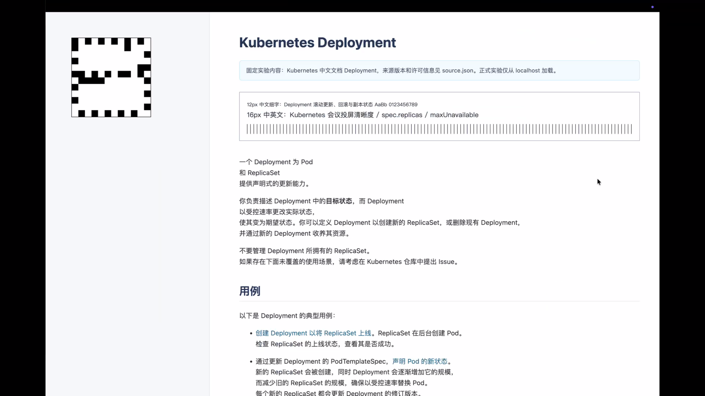
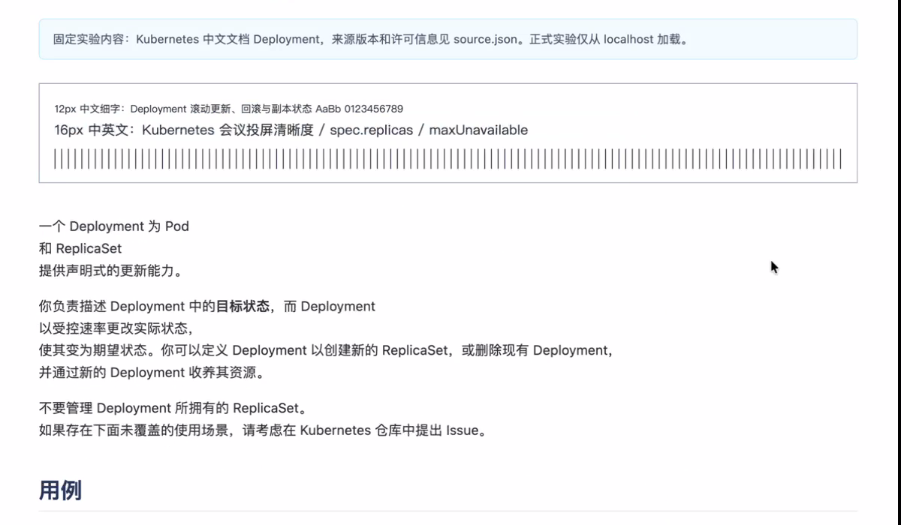
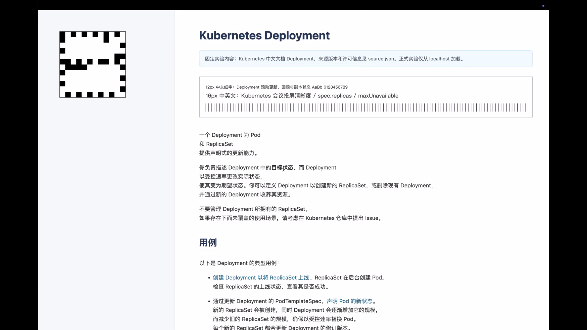

# HEVC 色彩与亮度范围修复结果（2026-07-18）

## 结论

本次复现环境中的 HEVC 整体偏亮问题已经解决。macOS sender 统一改为直接采集 NV12 video-range（`420v`），并显式指定 SDR Rec.709 color matrix 与 color space；H.264 和 HEVC 由此使用同一套压缩视频范围契约。修复没有增加逐帧 CPU 转换，也没有修改 WebRTC encoder、Android renderer、码率控制或 content-aware MaxQP 机制。

修复后的短 E2E 中，HEVC 最差静态 SSIM-Y/PSNR-Y 从上一轮的 0.9758/35.54 dB 提升到 0.99774/40.08 dB，达到并略高于同轮 H.264 的 0.99720/38.25 dB。执行者逐张查看 sender、Android decoded 和实际 `receiver-playing` 原图后，确认 HEVC 不再出现白底抬升、浅灰边框消失和小字号对比度降低。

该结论覆盖当前 M5 Pro/macOS 26.5.2 sender 与 Android TV emulator 上实际使用的两个 decoder。物理 Android TV 的 vendor decoder/HDMI black level 不在现有证据范围内；上线前仍应在目标电视型号上用同一组四码流 probe 做一次确认。HEVC 能否成为生产优先策略仍受另一个已知问题约束：content-aware detector 的 ACTIVE→STATIC 往返稳定性尚未通过上一轮正式实验。

## 根因

问题出在 full-range 内容进入 Android decoder 的 `ImageReader` Surface 后，不同 codec decoder 的范围处理不一致：

| 输入码流 | Android decoder | output format | Surface Y 行为 |
|---|---|---|---|
| H.264 `420f` | `c2.goldfish.h264.decoder` | FULL | 归一化到 video-range |
| HEVC `420f` | `c2.android.hevc.decoder` | FULL | 保留 full-range code values |
| H.264/HEVC `420v` | 上述 decoder | LIMITED | 两者产生相同 video-range values |

旧链路对两个 codec 都发送 `420f`。direct-decode probe 证明两个 decoder 在 Surface 边界已经产生不同数值；上一轮真实 `SurfaceViewRenderer` E2E 进一步记录到 HEVC 约 `1.16x - 18` 的亮度映射及高光裁切。Android output format 同时把两个 full-range 码流报告为 FULL，因此只读 metadata 无法识别这一差异。证据能够定位 decoder Surface 的 codec-specific 分歧，并证明该分歧会穿过生产 renderer；它不把 `ImageReader` 当成生产 GLES renderer 的替身。

原生 VideoToolbox 与实际 WebRTC XCFramework 的四格 probe 均排除了 sender encoder：

| Probe | H.264 `420f` | HEVC `420f` | H.264 `420v` | HEVC `420v` |
|---|---:|---:|---:|---:|
| 原生 VideoToolbox 软件解码 identity MAE | 0.0 | 0.0 | 0.0 | 0.0 |
| RTC encoder wrapper 软件解码 identity MAE | 0.0 | 0.0 | 0.0 | 0.0 |
| 实际硬件 encoder | Apple AVE AVC | Apple AVE HEVC | Apple AVE AVC | Apple AVE HEVC |

因此不需要改 SPS/VUI、HEVC encoder wrapper 或按 decoder 名称增加 shader 补偿。统一 `420v` 能在保持 native `CVPixelBuffer` zero-copy 路径的同时，让两个 codec 在 Android Surface 侧得到相同数值契约。

## 实现

`ScreenSourceProvider` 现在设置：

- `kCVPixelFormatType_420YpCbCr8BiPlanarVideoRange`；
- `CGDisplayStream.yCbCrMatrix_ITU_R_709_2`；
- `CGColorSpace.itur_709`。

H.264/HEVC codec policy、STATIC MaxQP 24、ACTIVE MaxQP 32 与现有 content-aware 切换逻辑保持不变。测试先要求 `420v` 和 Rec.709 metadata，在旧实现上分别观察到 pixel format 与空 metadata 的失败，再完成实现使测试转绿。

## 两组短 E2E

实验只运行一组 H.264 A0 和一组 HEVC A1。两组使用同一份本地 Kubernetes Deployment 固定文档、Chrome 150.0.7871.129、相同滚动节奏、同一 WebRTC artifact 和相同 MaxQP 24/32；两次均一次有效，没有 infrastructure retry。

| Case | Codec | 首帧 ms | ACTIVE p95 ms | VT drop | 峰值 bitrate Mbps | 最差 SSIM-Y | 最差 PSNR-Y |
|---|---|---:|---:|---:|---:|---:|---:|
| A0 | H.264 | 1554.8 | 168.8 | 0 | 4.53 | 0.99720 | 38.25 |
| A1 | HEVC | 1424.2 | 208.5 | 0 | 1.86 | 0.99774 | 40.08 |

两组 telemetry 都证明 STATIC 24 与 ACTIVE 32 已对当前 encoder session 成功应用。30 秒 smoke run 压缩了静止间隔，不能替代上一轮 12-run 实验对 detector 往返稳定性的判断；本轮只验证色彩修复没有绕过或关闭 content-aware MaxQP。

上一轮 HEVC 相对 H.264 的 codec-specific range expansion 已消失。固定文档不是连续灰阶 chart，正文边缘还会受帧时序、抗锯齿和压缩影响，因此没有用任意正文像素回归冒充 renderer affine range 指标。范围数值由四格 patch probe 判定，E2E 使用 H.264 head-to-head、黑白端点、浅灰边框、低饱和蓝色和 Y-plane 质量共同验收。

## 人工截图检查

执行者以原始分辨率查看了 A0/A1 的 sender sequence 1、Android decoded sequence 1、最终 `receiver-playing`，并重新查看上一轮偏亮的 A1 截图。修复后的两个 codec 均满足：

- 黑色 marker 与黑色 surround 没有抬升；白色文档背景没有裁切；
- 浅灰边框、蓝色提示框和标题颜色在 H.264/HEVC 间一致；
- 12 px 中文、16 px 中英文、1 px 竖线均清晰；
- HEVC 不再呈现上一轮肉眼可见的发白和对比度下降。

### A0：H.264 修复后参考

### A1：HEVC 修复后

上一轮偏亮截图保留在 [HEVC 会议投屏实验结果](2026-07-18-hevc-meeting.md)，可用于 before/after 对照。

## 验证与证据处理

- Builder：114 个 Python tests 通过；原生 VideoToolbox 与 RTC wrapper 四格 probe 均通过。
- Android：direct `MediaCodec`/`ImageReader` Surface instrumentation test 对四个码流均通过，复现 `420f` 的 codec-specific 差异，并证明 `420v` H.264/HEVC 输出 patch values 完全一致；生产 `SurfaceViewRenderer` 由两组 E2E 单独验证。
- 下游：`make verify` 通过，包括 Go race tests、128 个 macOS tests、Android unit/lint、脚本测试和 macOS/Android builds。
- E2E：A0/A1 各一组，2/2 valid，0 retry；执行者已查看 6 张原始关键图和 2 张发布裁剪图。

原始 evidence 留在 Git ignored 的 `artifacts/`/`evidence/` 目录。发布截图只包含固定开源文档，经过 PNG 重新编码和 extended attributes 清理；metadata 中没有作者、来源 URL 或本机路径。版本化文档没有 TURN 凭据、网络地址、用户名、设备标识或绝对路径。

## 后续约束

1. 在目标物理 Android TV 的 vendor H.264/HEVC decoder 上复跑四个 direct-decode 样本；若 `420v` 输出一致，只需补充设备证据，不扩大 codec 参数实验。
2. 单独解决 content-aware detector 的 ACTIVE→STATIC 稳定性，再按原计划重跑基础 codec 候选。
3. HDR、Display P3、P010/10-bit 需要新的端到端色彩契约；本次 SDR Rec.709 修复不能直接外推。
