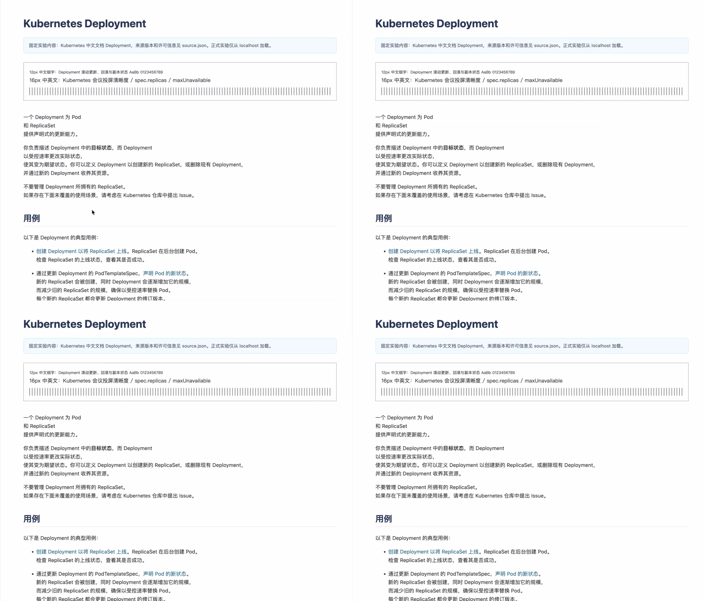
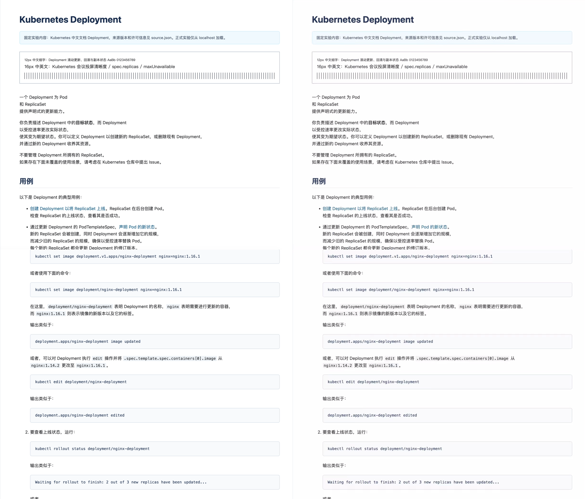

# HEVC 会议投屏修复后复测报告（2026-07-18）

## 结论

这次复测确认，上一轮阻断 HEVC 判断的三个基础问题已经得到实质修复：HEVC sender→Android 不再出现明显发白；六次固定滚动在 12 个 run 中全部绑定到六次 ACTIVE→STATIC 业务往返；延迟 marker 也已经由正文发生第一次真实滚动时提交，测到的是用户触发正文更新后，画面到达 Android render callback 的时间。

在四个 base case 中，B0（H.265，STATIC/ACTIVE MaxQP 33/39）最接近“低延迟、高清晰度、低带宽”的会议极速投屏目标。相对 H.264 A0，B0 的正文更新 E2E p95 从 294.5 ms 降到 233.4 ms，改善 61.1 ms（20.8%）；三轮峰值 bitrate 上界从 4.45 Mbps 降到 1.98 Mbps，降低 55.5%；首帧中位数从 1495.6 ms 降到 1326.1 ms。三轮均无 VideoToolbox drop，人工检查的小字号文字、细线和浅色边框保持清楚，最差静态 SSIM-Y/PSNR-Y 为 0.996185/39.60 dB。

但本轮仍不建议把生产默认从“优先 H.264”切到“优先 H.265”，也不进入 Low Latency Rate Control、Spatial AQ 或 B-frame feature stage。HEVC 的画质和正文更新延迟已经达到继续推进的水平，剩余问题是 `max_render_gap` 证据不可判定：tracker 设计上可能把滚动结束后的静态抑帧尾段计入一秒 ACTIVE 窗口，而原始数据只保留每轮的最大值，无法区分真实动态卡顿与尾段污染。H.264 与全部 HEVC case 又都超过 500 ms，因此在排除真实 freeze 之前不能切换默认。下一步只需修正这一项测量，再对 A0/B0 各跑三次；无需继续扩展 QP 或 feature flag 矩阵。

当前产品策略建议保持不变：默认仍为优先 H.264；`h265-only` 与 `prefer-h265` 保留为设备定向实验能力。B0 是唯一值得进入下一轮 A/B 校准的 HEVC 参数，不再继续 A1、B1 或其他 MaxQP 组合。

## 正式实验设计与有效性

本轮使用 Chrome 渲染固定的本地 Kubernetes 中文 Deployment 文档。内容不依赖登录态或互联网实时数据。每个 run 初始静止 20 秒，随后每隔 8 秒执行一次固定的 720 px 滚动，共六次，最后静止 20 秒。四组 case 各重复三次，共 12 个正式 run；12/12 有效，0 invalid，0 retry。

| Case | Codec | 业务作用 | STATIC/ACTIVE MaxQP |
|---|---|---|---:|
| A0 | H.264 | 参数对齐的生产参考 | 24/32 |
| A1 | H.265 | 与 A0 使用相同上限的 head-to-head 对照 | 24/32 |
| B0 | H.265 | 较宽松、由 HEVC 实测经验选出的主候选 | 33/39 |
| B1 | H.265 | 只收紧静态上限，验证是否值得为文字质量付出代价 | 30/39 |

A1 的 24/32 只是控制变量，不表示 H.264 与 H.265 的 QP 数字具有相同的主观质量含义。B0/B1 才是在真实 HEVC 硬件链路上检验过的候选区间。这样的设计既保留了 H.264/H.265 head-to-head，又没有把 H.264 的 QP 经验生搬到 HEVC 最终策略。

正式运行的 app commit 为 `d829b1cce2101611a696098e0807b15eff921595`，分析器在 `b8dc4d4` 对齐了最新 detector 的 `active` mode 与 `clarity_active_restores` telemetry；该修正只改变已有原始证据的解释口径，没有改写实验数据。其余 provenance 如下：

- builder commit：`da7818a854bb5d227f306af9816d2b54ebc7a74e`
- macOS WebRTC artifact SHA-256：`74344a3ab08b49e445dc47258cb02e696a4a9b6eb04eb09d866552aefbdfabc7`
- Android WebRTC AAR SHA-256：`a85c2cb62dff0c48ec07cd33c10ddcdcb8a3ad650fd83e21ec489e8fe68a8674`
- macOS executable SHA-256：`af3d4a59f2e3131228509de9e838f25e765f06622973a62d2da833bd34945b7d`
- Android APK 由每个 run 单独构建，SHA-256 不同；实际值保存在各 run 的 `build-provenance.json`
- Chrome：`150.0.7871.129`
- 网络 profile：`production-relay`，UDP
- 原始结果：`artifacts/hevc-meeting-rerun-formal/20260718T101209Z/`

## 聚合结果

每个 case 的 ACTIVE 延迟包含 3×6=18 个正文滚动样本。首帧取三轮中位数；render gap 展示三轮范围；bitrate 取三轮最大值；画质取六张初始/最终静态样本中的最差值。

| Case | 实际 key/delta QP p95（最大） | 首帧中位数 ms | 正文 E2E p50/p95 ms | render gap 范围 ms | VT drop | 峰值 bitrate Mbps | 最差 SSIM-Y / PSNR-Y | 人工文字检查 |
|---|---:|---:|---:|---:|---:|---:|---:|---|
| A0 | 32/32（32） | 1495.6 | 271.2/294.5 | 601.9–624.7 | 0 | 4.45 | 0.996736 / 37.66 | 通过 |
| A1 | 32/32（32） | 1401.2 | 176.9/242.4 | 568.1–621.2 | 0 | 2.23 | 0.995655 / 39.30 | 通过 |
| B0 | 33/35（37） | 1326.1 | 173.8/233.4 | 537.1–614.5 | 0 | 1.98 | 0.996185 / 39.60 | 通过 |
| B1 | 31/33（37） | 1429.9 | 188.8/240.9 | 600.2–637.4 | 0 | 2.01 | 0.996186 / 39.33 | 通过 |

自动 base report 按预设硬门禁把 A1、B0、B1 都标记为 `render_freeze` 失败，因此没有启动 feature stage。这个“未过门禁”的机器结论应保留；但从业务解释上，它表示当前 freeze 证据不足，而不是已经证明三组 HEVC 都发生了用户可见卡顿。

## 画质结果

### 发白问题已经消失

我使用 `view_image(detail=original)` 亲自检查了四个 case 的 sender 全景、Android decoded 全景、正文细节和 receiver 最终画面，覆盖三次重复的初始、滚动后和最终静态位置。检查重点是 12 px 中文、16 px 中英文混排、浅灰代码框、蓝色提示框、1 px 竖线、黑白 marker 边缘及大面积白底。

本轮 HEVC Android decoded 画面没有再出现上一轮明显的亮度抬高、浅灰边框变淡和正文对比度下降。A0、A1、B0、B1 的白底、深色文字和浅色组件已经基本对齐；所有组均未观察到 block、ringing、ghosting、滚动残影、黑帧或文字笔画断裂。

同一轮内部比较也支持这一判断。B0 相对 A0 的最差 SSIM-Y 只低 0.000551，远小于实验预设的 0.002 容忍度；B0 的最差 PSNR-Y 反而高 1.94 dB。A1 的最差 SSIM-Y 比 A0 低 0.001081，同时 PSNR-Y 高 1.64 dB，因此不满足“SSIM 与 PSNR 同时明显退化”的质量失败条件。

与修复前的同名 case 相比，A1 的最差 SSIM-Y/PSNR-Y 从 0.9758/35.54 dB 提升到 0.995655/39.30 dB，B0 从 0.9746/35.35 dB 提升到 0.996185/39.60 dB；方向与人工看到的“发白消失”一致。由于本轮同时包含 detector 和 marker 修复，这个跨轮变化不能被当作只隔离 color-range 的单变量结果，但它足以说明旧的系统性 HEVC 画质阻断已经不再存在。

下面第一张图是 Android 初始静态画面的四组并排细节，顺序为左上 A0、右上 A1、左下 B0、右下 B1。

第二张图用于检查 B0 的 sender→Android 一致性：左列为 sender capture，右列为 Android decoded；上排是初始静态位置，下排是六次滚动后的最终位置。正文、小字号测试行、细线和浅色框均保持一致。

### B0 的 QP 取值更符合 HEVC 实测价值

B0 配置为 STATIC/ACTIVE 33/39，但实际 key/delta QP p95 只有 33/35，观测最大值为 37；编码器没有长期贴住 ACTIVE 上限 39。B1 把 STATIC 上限从 33 收紧到 30 后，最差 SSIM-Y 仅从 0.996185 变为 0.996186，人工检查也没有可辨收益，而正文 E2E p95 从 233.4 ms 变为 240.9 ms。

因此，当前证据不支持为了“数字看起来更保守”而选择 B1，也不支持继续向更低 HEVC QP 扩展。B0 的 33/39 是在本链路上由画质、延迟和码率共同验证出的经验值；A1 的 24/32 只应保留为 H.264 参数对齐参考。

## 延迟结果

### 正文更新延迟已经可用

旧实验先改变固定 marker，再触发正文滚动，marker 可能先于正文 compositor update 到达 Android。本轮 marker sequence 在第一次真实 `scroll` event 上提交，并在整个固定 burst 中随 `scrollY` 保持在可检测区域。因此 18 个样本/组测量的是“正文开始真实滚动”到“包含该 sequence 的视频帧进入 Android render callback”的链路延迟，而不是独立 overlay 的提前到达时间。

四组共 72 个正文滚动 sequence 全部同时具备 workload、sender capture 和 Android render 证据，delivery ratio 为 72/72。B0 的正文 E2E p50/p95 为 173.8/233.4 ms，优于 A0 的 271.2/294.5 ms；B0 三个独立 run 的 p95 为 216.2–232.4 ms，A0 为 291.2–296.3 ms，改善不是由单轮偶然值造成。A1 与 B1 的聚合 p95 也分别比 A0 低 52.0 ms 和 53.6 ms。就本次固定会议文档而言，HEVC 没有以更高交互延迟换取带宽收益，反而在相同设备和网络 profile 下同时降低了 p95 与峰值 bitrate。

首帧是从 session 启动到 Android 首个可渲染画面的时间，包含建连、协商和首个关键帧，不等同于用户滚动时的响应延迟。B0 的三轮首帧为 1310.1–1327.9 ms，中位数比 A0 低 169.5 ms；样本只有三次，适合作为“没有首帧回退”的证据，不宜据此宣称稳定降低 169.5 ms。

### `max_render_gap` 目前不能证明 freeze

Android 的 `ActiveWindowGapTracker` 在 sequence 2–7 第一次出现时打开固定一秒窗口，并明确把“最后一帧到窗口结束”的尾段纳入最大 gap 计算。因此，当固定 scroll burst 在一秒前结束、static-aware sender 开始减少不变内容帧时，这段尾部可能放大统计值。

实测四组范围均超过 500 ms：A0 为 601.9–624.7 ms，A1 为 568.1–621.2 ms，B0 为 537.1–614.5 ms，B1 为 600.2–637.4 ms。原始 receiver evidence 每个 run 只保存一个 `max_frame_gap_ms` summary，没有保存最大 gap 所属 sequence、起止时间或它位于窗口内部还是尾段。H.264 基线同样失败，且四组都没有 VideoToolbox drop；因此该指标不能支持“HEVC 出现编码卡顿”的归因，也不能支持“B0 已经通过 freeze 门禁”的结论。截图只能证明所保留的关键时刻画面正常，不能覆盖滚动过程中的每一帧。

下一轮应把 gap 统计窗口收敛到正文实际滚动区间，并用显式 scroll-end 证据结束窗口。修正后只重跑 A0 与 B0 各三次。如果 B0 在这个校准后的门禁上通过，就具备进入设备定向 `prefer-h265` canary 的基础；如果仍出现超过 500 ms 的真实动态帧间隔，再回到 encoder/transport/decoder 分段定位。

## Static-aware 机制结果

最新 detector telemetry 使用 `active` mode 和 `clarity_active_restores`。分析器已按这个公开语义重算：12 个 run 的每一次固定滚动都先观察到对应 ACTIVE MaxQP，再在下一次滚动前观察到 STATIC MaxQP，逐次绑定 generation、encoder session、QP sample 和关键帧。结果是每个 run 6/6，合计 72/72 个业务状态周期有效。

全局 transition counter 每个 run 为 15–18 次，高于六次。该计数还可能包含 marker 更新、截图和 Chrome compositor 的其他真实画面活动，不能等同于六个业务滚动周期。旧分析器把全局 counter 强制要求为 6，既使用了过期的 `motion` 字段，也把所有画面活动错误地算成 detector thrashing。本轮保留两个指标：业务判断使用六个逐 burst 绑定周期；全局 counter 单独记录，便于继续观察 detector 的整体敏感度。

对当前实验目标而言，static-aware 机制已经能够稳定服务“静态文字使用 STATIC MaxQP、滚动内容使用 ACTIVE MaxQP”的策略。B0 的画质和码率结果也说明，这一动态策略无需再增加更多 QP 轮次来证明价值。

## 业务决策

本轮应形成三个明确动作：

1. 接受 color-range、content-aware detector 和 scroll-bound latency marker 三项基础修复，旧报告中的 HEVC 系统性发白、六次状态往返不稳定、marker 先于正文更新三个阻断不再成立。
2. 生产默认继续优先 H.264；`h265-only` 和 `prefer-h265` 只用于受控设备实验。B0 33/39 是唯一保留的 HEVC 候选。
3. 不运行 C0/C1/C2 等 feature stage。先修正动态 gap 的结束边界，然后只做 A0/B0 各三次，共六个 run。该结果足以决定是否开启小流量 `prefer-h265` canary。

这使实验继续围绕会议极速投屏的核心价值收敛：静态文字要清楚，真实正文更新要快，码率要可控，同时不能把 static-aware 的正常抑帧误判为卡顿。

## 隐私与证据边界

原始 evidence 包含构建日志、设备诊断、运行目录和网络过程信息，只保留在被 Git ignore 的本地 `artifacts/`，不进入版本库。提交的两张关键截图只包含固定 Kubernetes 文档 fixture 和实验 marker，不含浏览器账户、真实会议、联系人、邮箱、用户名、设备标识、凭据、私有 URL 或私有网络地址。图片已重新编码，并检查可见内容与嵌入文本；文件系统的 provenance 扩展属性不进入 Git blob。版本库只发布聚合结果、不可逆 artifact hash 和固定文档截图。

本报告只覆盖一台发送端、一台固定 Android TV 接收端、Chrome 150、production relay UDP 和单一文档型 workload。它足以淘汰 A1/B1、确定 B0 为下一候选，并验证三项基础修复；尚不足以代表不同 Android 解码器、Wi-Fi 丢包、视频内容或长时间会议下的总体表现。
